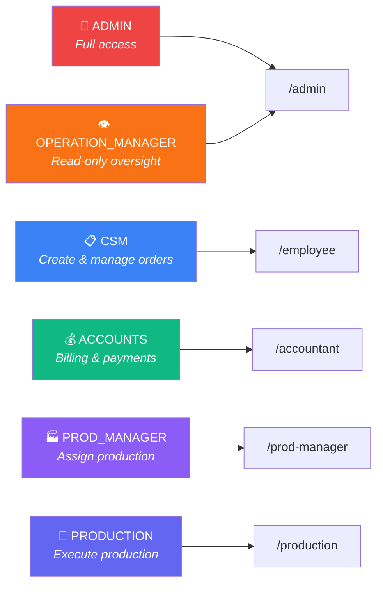
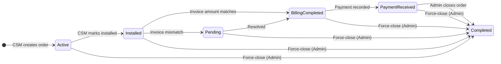
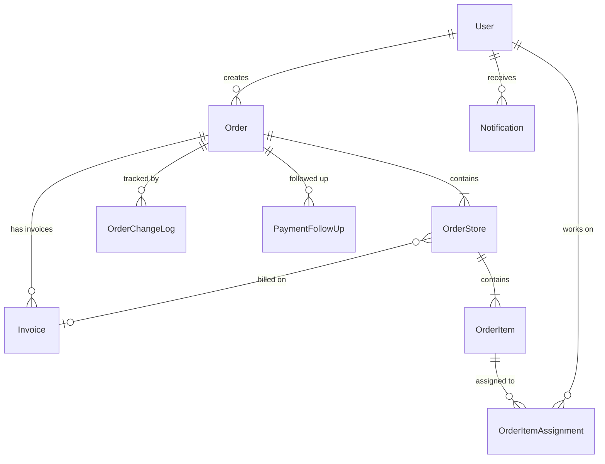

<p align="center">
  
</p>

<p align="center">
  
  
  
  
  
  
  
</p>

<p align="center">
  <em>Internal order management system for <strong>Sai Balaji Digitals</strong>, a signage & printing company.<br/>
  Tracks orders from creation through production, billing, payment, and completion — with role-based dashboards, email notifications, TAT tracking, and Excel import/export.</em>
</p>

<p align="center">
  <strong>Built for 50–60 employees across 6 roles</strong>
</p>

---

## 📋 Table of Contents

- [✨ Highlights](#-highlights)
- [🏗️ Architecture](#️-architecture)
- [🚀 Getting Started](#-getting-started)
- [👥 User Roles](#-user-roles)
- [📦 Order Pipeline](#-order-pipeline)
- [🎯 Key Features](#-key-features)
- [🔌 API Reference](#-api-reference)
- [🗄️ Database Schema](#️-database-schema)
- [🔒 Security](#-security)
- [🏭 Production Build](#-production-build)
- [📄 License](#-license)

---

## ✨ Highlights

<table>
  <tr>
    <td width="50%">

**🎯 6 Role-Based Portals**
Admin, Operation Manager, CSM, Accounts, Production Manager, Production — each with a tailored dashboard and scoped permissions.

</td>
    <td width="50%">

**📊 Real-Time Dashboards**
Pipeline KPIs, revenue trends, leaderboards, overdue tracking — with clickable drill-downs and amount/quantity toggles.

</td>
  </tr>
  <tr>
    <td>

**⏱️ TAT Tracking**
Business-day calculations (excluding Sundays) with per-stage aging, configurable thresholds, and overdue Excel exports.

</td>
    <td>

**📧 Branded Email System**
HTML templates for every workflow event — order changes, billing diffs, invoice mismatches, and Excel export delivery.

</td>
  </tr>
  <tr>
    <td>

**📥 Excel Import/Export**
Bulk order import with all-or-nothing validation, line-item import into forms, filtered exports, and downloadable templates.

</td>
    <td>

**🏪 Multi-Store Orders**
Each order supports multiple stores with independent installations, POs, invoices, and line items.

</td>
  </tr>
</table>

---

## 🏗️ Architecture

<details open>
<summary><strong>Tech Stack</strong></summary>

| Layer | Technology |
|:------|:-----------|
| **Frontend** | React 19 · TanStack Router · TanStack Query · Tailwind CSS 4 · shadcn/ui (Radix) · Recharts |
| **Backend** | Express 4 · Prisma ORM · PostgreSQL |
| **Auth** | JWT (httpOnly cookie) · bcrypt (cost 12) · Role-based authorization |
| **Email** | Nodemailer 9 with branded HTML templates |
| **Monorepo** | npm workspaces (`apps/api` · `apps/web` · `packages/shared-types`) |

</details>

<details>
<summary><strong>📂 Project Structure</strong></summary>

```
sb-oms-monorepo/
├── 📁 apps/
│   ├── 📁 api/                    # Express + Prisma backend
│   │   ├── 📁 prisma/
│   │   │   ├── schema.prisma     # Database schema (12 models)
│   │   │   ├── seed.ts           # Production seed (users)
│   │   │   └── seed-test-data.ts # Test data seeder
│   │   └── 📁 src/
│   │       ├── server.ts         # Express app entry point
│   │       ├── controllers/      # Route handlers (11 controllers)
│   │       ├── middlewares/      # Auth, rate limiting
│   │       ├── routes/           # API route definitions (8 route files)
│   │       ├── services/         # Email & notification services
│   │       └── utils/            # Config, validators, helpers
│   └── 📁 web/                    # React frontend
│       └── 📁 src/
│           ├── api/              # API client functions
│           ├── components/       # Reusable UI components
│           ├── lib/              # Hooks and utilities
│           └── routes/           # File-based routing (TanStack)
├── 📁 packages/
│   └── 📁 shared-types/           # Shared TypeScript types
├── package.json                  # Workspace root
└── .env.example                  # Frontend env template
```

</details>

---

## 🚀 Getting Started

### Prerequisites

| Requirement | Version |
|:------------|:--------|
|  | `v18` or newer |
|  | `v14` or newer |
|  | `v9` or newer |

### 1️⃣ Clone & Install

```bash
git clone https://github.com/im-notpranav/SaiBalajiDigitals.git
cd SaiBalajiDigitals
npm install
```

### 2️⃣ Configure Environment

```bash
cp apps/api/.env.example apps/api/.env
```

<details>
<summary><strong>📋 Environment Variables</strong></summary>

**Required:**

| Variable | Description |
|:---------|:------------|
| `DATABASE_URL` | PostgreSQL connection string |
| `JWT_SECRET` | Random string, ≥ 32 characters — **server will not start without this** |

**Optional (defaults shown):**

| Variable | Default | Description |
|:---------|:--------|:------------|
| `JWT_EXPIRES_IN` | `7d` | Token expiry duration |
| `PORT` | `3001` | API server port |
| `NODE_ENV` | `development` | Environment mode |
| `CLIENT_URL` | `http://localhost:5173` | Frontend URL (CORS origin) |
| `SMTP_HOST` | — | SMTP server for email notifications |
| `SMTP_PORT` | `587` | SMTP port |
| `SMTP_USER` | — | SMTP username |
| `SMTP_PASS` | — | SMTP password |
| `ADMIN_EMAIL` | `admin@saibalaji.com` | Admin notification recipient |

</details>

### 3️⃣ Set Up the Database

```bash
cd apps/api
npx prisma migrate dev
npx tsx prisma/seed.ts
```

### 4️⃣ Run Development Servers

```bash
# From the project root
npm run dev
```

> **🌐 Your app is now running!**
>
> | Service | URL |
> |:--------|:----|
> | 🖥️ Web App | [`http://localhost:5173`](http://localhost:5173) |
> | ⚙️ API Server | [`http://localhost:3001`](http://localhost:3001) |

---

## 👥 User Roles



| Role | Portal | Capabilities |
|:-----|:-------|:-------------|
| **ADMIN** | `/admin` | Full access — orders, users, dashboards, audit log, settings, bulk import, force-close |
| **OPERATION_MANAGER** | `/admin` _(read-only)_ | View everything, modify nothing — oversight role |
| **CSM** _(Client Service Manager)_ | `/employee` | Create/edit orders, flag items, view own dashboard |
| **ACCOUNTS** | `/accountant` | Invoice reconciliation, payment recording, billing edits, follow-ups |
| **PRODUCTION_MANAGER** | `/prod-manager` | Assign production items to staff, view team workload |
| **PRODUCTION** | `/production` | View assigned items, mark production complete |

---

## 📦 Order Pipeline



<details>
<summary><strong>📋 Stage Details</strong></summary>

| Stage | Trigger | Who |
|:------|:--------|:----|
| **Active** | Order created by CSM | CSM, Admin |
| **Installed** | CSM marks installation complete | CSM, Admin |
| **BillingCompleted** | Accountant submits invoice (amount matches) | Accounts, Admin |
| **Pending** | Invoice amount doesn't match order total | Accounts, Admin |
| **PaymentReceived** | Accountant records payment | Accounts, Admin |
| **Completed** | Admin closes the order with a remark | Admin |

> 💡 Orders can be **force-closed** by Admin at any stage with a reason:
> _Reprint · Sample · Under Warranty · Free of Cost · Revised · Extra/Less Amount · Other_

</details>

---

## 🎯 Key Features

<details open>
<summary><strong>📊 Dashboards</strong></summary>

| Dashboard | Key Metrics |
|:----------|:------------|
| **Admin** | Pipeline overview · KPIs · Revenue trends · CSM leaderboard · Payment overdue tracking |
| **CSM** | Personal pipeline by stage · Date range filtering · Amount/quantity toggle · Drill-down tables |
| **Production Manager** | Active orders · Team workload cards · Pending items with aging badges |
| **Accountant** | Billing queue · Payment queue · Overdue (>30 days) · Collected amounts |

</details>

<details>
<summary><strong>⏱️ TAT (Turn-Around Time) Tracking</strong></summary>

- 📅 Business days calculated **excluding Sundays**
- 📊 Per-stage aging with configurable thresholds
- ⚠️ `>7 days` in any stage = severe (badge indicator)
- 🏭 Production TAT: ≤ 2 days · Payment TAT: ≤ 30 days
- 📥 Overdue report with Excel export

</details>

<details>
<summary><strong>📧 Email Notifications</strong></summary>

- 🎨 Branded HTML email templates for all workflow events
- 📝 Order creation, edits, status transitions, flag alerts
- 💰 Billing/payment edit diffs sent to admin
- ⚠️ Invoice mismatch alerts
- 📎 Excel export attachment delivery

</details>

<details>
<summary><strong>📥 Excel Features</strong></summary>

| Feature | Description |
|:--------|:------------|
| **Export** | Download or email filtered order data as `.xlsx` |
| **Line-item import** | CSMs can import items from Excel into the order form |
| **Bulk import** | Super-admin can import full orders (all-or-nothing validation) |
| **Templates** | Pre-formatted downloadable templates for both import types |

</details>

<details>
<summary><strong>💰 Billing & Payments</strong></summary>

- 📄 Invoice reconciliation with mismatch detection
- ✏️ Billing and payment edit history with admin notifications
- 💬 Payment follow-up remarks timeline (1st, 2nd, 3rd… with date & author)
- 📅 Financial year configuration (June 1 – May 31)
- 🏪 Multi-invoice support per order (one per store group)

</details>

<details>
<summary><strong>🏭 Production Management</strong></summary>

- 👥 Multi-team assignment per line item
- ✅ Production completion tracking per assignment
- 📊 Team workload visualization
- 📏 SFT (Square Foot) calculations and reporting

</details>

<details>
<summary><strong>🛡️ Audit & Compliance</strong></summary>

- 📝 Database-level audit triggers (full before/after JSON snapshots)
- 🔍 Order change log with field-level diffs
- 🔔 In-app notifications with bell icon and unread count

</details>

---

## 🔌 API Reference

<details>
<summary><strong>🔐 Auth</strong></summary>

| Method | Path | Auth | Description |
|:-------|:-----|:-----|:------------|
| `POST` | `/api/auth/login` | ❌ | Login _(rate limited: 10/15min)_ |
| `POST` | `/api/auth/logout` | ✅ | Logout |
| `GET` | `/api/auth/me` | ✅ | Current user info |

</details>

<details>
<summary><strong>📦 Orders</strong> — 14 endpoints</summary>

| Method | Path | Roles | Description |
|:-------|:-----|:------|:------------|
| `GET` | `/api/orders` | All | List orders (paginated, filterable) |
| `GET` | `/api/orders/:id` | All | Order detail |
| `POST` | `/api/orders` | CSM, Admin | Create order |
| `PUT` | `/api/orders/:id` | CSM, Admin | Update order |
| `DELETE` | `/api/orders/:id` | Admin | Delete order |
| `PUT` | `/api/orders/:id/install` | CSM, Admin | Mark installed |
| `PUT` | `/api/orders/:id/invoice` | Accounts, Admin | Submit invoice |
| `PUT` | `/api/orders/:id/payment` | Accounts, Admin | Record payment |
| `PATCH` | `/api/orders/:id/billing` | Accounts, Admin | Edit billing |
| `PATCH` | `/api/orders/:id/payment-edit` | Accounts, Admin | Edit payment |
| `PUT` | `/api/orders/:id/close` | Admin | Close order |
| `PUT` | `/api/orders/:id/force-close` | Admin | Force-close order |
| `PATCH` | `/api/orders/:orderId/items/:itemId/flag` | CSM, Admin | Flag line item |
| `PATCH` | `/api/orders/:orderId/items/:itemId/assign` | Prod Manager, Admin | Assign production |
| `PATCH` | `/api/orders/:orderId/items/:itemId/complete` | Production, Prod Mgr, Admin | Mark complete |
| `GET` | `/api/orders/export` | CSM, Admin, OpMgr, Accounts | Download Excel |
| `POST` | `/api/orders/export/email` | CSM, Admin, OpMgr, Accounts | Email Excel _(rate limited)_ |
| `POST` | `/api/orders/import` | Super-admin | Bulk import from Excel |

</details>

<details>
<summary><strong>📊 Dashboards</strong></summary>

| Method | Path | Roles | Description |
|:-------|:-----|:------|:------------|
| `GET` | `/api/dashboard/admin` | Admin, OpMgr | Admin dashboard |
| `GET` | `/api/dashboard/csm` | CSM, Admin, OpMgr | CSM dashboard |
| `GET` | `/api/dashboard/prod-manager` | Prod Manager, Admin | Production dashboard |
| `GET` | `/api/dashboard/accountant` | Accounts, Admin | Accountant dashboard |

</details>

<details>
<summary><strong>👤 Users</strong></summary>

| Method | Path | Roles | Description |
|:-------|:-----|:------|:------------|
| `GET` | `/api/users` | Admin, OpMgr | List all users |
| `POST` | `/api/users` | Super-admin | Create user |
| `PUT` | `/api/users/:id` | Super-admin | Update user |
| `DELETE` | `/api/users/:id` | Admin | Delete user |
| `PUT` | `/api/users/:id/status` | Admin | Activate/deactivate |
| `PUT` | `/api/users/:id/password` | Super-admin | Reset password |

</details>

---

## 🗄️ Database Schema



<details>
<summary><strong>📋 Model Details</strong></summary>

| Model | Purpose |
|:------|:--------|
| **User** | Employees with roles, credentials, active status, profile info |
| **Order** | Main order record — client, status, PO number, remarks |
| **OrderStore** | Physical stores within an order — each with own location, PO, installation |
| **OrderItem** | Line items — media, dimensions, qty, rate, SFT, amount |
| **Invoice** | Invoices raised against store groups — bill amount, payment tracking |
| **OrderItemAssignment** | Production assignment per item per team member |
| **OrderChangeLog** | Field-level change tracking (old → new) |
| **AuditLog** | Database-trigger audit trail (full JSON snapshots) |
| **PaymentFollowUp** | Remarks timeline after billing |
| **Notification** | In-app notification bell |
| **EmailRecipient** | Recently-used export email addresses (autocomplete) |
| **Client / Media** | Lookup tables for autocomplete suggestions |
| **OrderSequence** | Tracks order numbering per financial year |

</details>

---

## 🔒 Security

| Measure | Implementation |
|:--------|:---------------|
| 🔐 **Authentication** | JWT in httpOnly cookie, `sameSite: strict`, `secure` in production |
| 🔑 **Password hashing** | bcrypt with cost factor 12 |
| 🛡️ **Authorization** | Role-based middleware on every route; read-only enforcement for OpMgr |
| 🚦 **Rate limiting** | Global (200 req/min) · Login (10/15min) · Email export (15/15min) |
| ✅ **Input validation** | Zod schemas on all mutating endpoints with sanitized error responses |
| 💉 **SQL injection** | Prisma ORM with parameterized queries |
| 🧹 **XSS** | React auto-escaping; no `dangerouslySetInnerHTML`; API returns JSON only |
| 🛡️ **CSRF** | `sameSite: strict` cookie policy |
| 🪖 **Security headers** | Helmet middleware (X-Frame-Options, HSTS, CSP, etc.) |
| 🔒 **Secrets** | All secrets via env vars; server crashes at boot if `JWT_SECRET` is missing |
| 🔄 **JWT re-validation** | Every request checks `is_active` and current `role` from database |
| 📝 **Audit trail** | Database triggers record all changes with full before/after snapshots |

---

## 🔢 Order Numbering

Orders follow the format **`ORD{YY}{NNNN}`** where:

- `YY` = 2-digit financial year code (FY starts **June 1**)
- `NNNN` = sequential number, starting from **13** each new FY (first 12 reserved)

> **Example:** `ORD260013` = first order of FY 2026–27

---

## 🧪 Test Data

```bash
# Seed 16 test orders across all pipeline stages
cd apps/api
npx tsx prisma/seed-test-data.ts

# Remove all test data
npx tsx prisma/seed-test-data.ts --cleanup
```

> Test orders use `TEST` prefix numbers (TEST0001–TEST0016) and `[TEST]` client name prefix for easy identification.

---

## 🏭 Production Build

```bash
# Build both apps
npm run build

# Start the API server
cd apps/api
node dist/server.js
```

> The web app builds to `apps/web/dist/` — serve with any static file server (Nginx, Vercel, Netlify, etc.).

---

## 📄 License

**Private** — internal use only.

---

<p align="center">
  <sub>Built with ❤️ for <strong>Sai Balaji Digitals</strong></sub>
</p>
